# 🏛️ 01. Arsitektur Sistem & Metodologi Riset

## 1. Pendahuluan & Filosofi Desain

Proyek ini dibangun untuk menyelesaikan permasalahan **Intent Classification** (Klasifikasi Niat/Maksud Pengguna) pada teks percakapan Bahasa Indonesia. Sistem ini dirancang secara **Domain-Agnostic** (independen dari satu domain tertentu), sehingga seluruh arsitektur kode dapat dengan mudah ditransfer ke berbagai bidang (pendidikan, perbankan, kesehatan, e-commerce, pariwisata, dsb.) tanpa perlu merombak *core logic* program.

---

## 2. Metodologi Riset: Standar CRISP-DM

Pengembangan proyek ini mengikuti 6 tahapan standar industri **CRISP-DM (*Cross-Industry Standard Process for Data Mining*)**:

```text
  ┌─────────────────────────────────────────────────────────────┐
  │ 1. Business Understanding (Klasifikasi Intent Multi-Class)   │
  └──────────────────────────────┬──────────────────────────────┘
                                 ▼
  ┌─────────────────────────────────────────────────────────────┐
  │ 2. Data Understanding (Struktur 8 Kolom & Distribusi Split)  │
  └──────────────────────────────┬──────────────────────────────┘
                                 ▼
  ┌─────────────────────────────────────────────────────────────┐
  │ 3. Data Preparation (Indonesian NLP Preprocessing & TF-IDF) │
  └──────────────────────────────┬──────────────────────────────┘
                                 ▼
  ┌─────────────────────────────────────────────────────────────┐
  │ 4. Modeling (Eksperimen E0–E6: MNB, LogReg, Linear SVM)     │
  └──────────────────────────────┬──────────────────────────────┘
                                 ▼
  ┌─────────────────────────────────────────────────────────────┐
  │ 5. Evaluation (Prioritas Metrik Macro F1 & OOS Detection)   │
  └──────────────────────────────┬──────────────────────────────┘
                                 ▼
  ┌─────────────────────────────────────────────────────────────┐
  │ 6. Deployment (Antarmuka Interaktif Web UI Streamlit)       │
  └─────────────────────────────────────────────────────────────┘
```

### Tahap 1: Business Understanding
- **Tujuan Bisnis:** Membangun asisten virtual cerdas yang mampu mengidentifikasi kebutuhan spesifik pengguna dari kalimat masukan (*utterance*) secara akurat.
- **Tantangan Utama:** Variasi bahasa percakapan non-formal (*slang*, singkatan, *typo*) dan pertanyaan di luar domain (*Out-of-Scope*).

### Tahap 2: Data Understanding
- Data berupa pasangan kalimat percakapan (*utterance*) dan label intent (*target class*).
- Pembagian data dilakukan secara ketat (*Train, Validation, Test, dan Out-of-Scope Test*) untuk menguji generalisasi model.

### Tahap 3: Data Preparation
- Pembersihan teks Bahasa Indonesia secara bertahap (*Case Folding*, *Punctuation/Number Removal*, *Slang Normalization*, *Stopword Removal*, dan *Stemming*).
- Transformasi teks ke bentuk numerik menggunakan *Term Frequency-Inverse Document Frequency* (TF-IDF) dengan kombinasi fitur Unigram dan Bigram.

### Tahap 4: Modeling
- Pelatihan model pembelajaran terbimbing (*Supervised Learning*):
  - **Multinomial Naive Bayes (MNB):** Model probabilistik berbasis Teorema Bayes.
  - **Logistic Regression (LogReg):** Model linear berbasis fungsi logit/softmax.
  - **Linear Support Vector Machine (Linear SVM):** Model pencarian *hyperplane* optimal yang dikalibrasi (*CalibratedClassifierCV*) untuk menghasilkan estimasi probabilitas keyakinan.

### Tahap 5: Evaluation
- Penilaian performa menggunakan metrik **Macro F1-Score** sebagai metrik utama guna menghindari bias kelas minoritas.
- Evaluasi stabilitas dengan 5-Fold Stratified Cross-Validation dan analisis ambang batas penolakan Out-of-Scope (OOS).

### Tahap 6: Deployment
- Penyajian model dalam antarmuka Web UI Chatbot berbasis **Streamlit** dengan *real-time confidence badge* dan mekanisme penolakan OOS otomatis.

---

## 3. Diagram Alur Data End-to-End

```text
[ Input Pengguna: "brp bya dftr mhs baru?" ]
                     │
                     ▼
       ┌───────────────────────────┐
       │ 1. TextPreprocessor       │
       │    - Slang Normalization  │ -> "berapa biaya daftar mahasiswa baru"
       │    - Stopword & Cleaning  │
       └─────────────┬─────────────┘
                     │
                     ▼
       ┌───────────────────────────┐
       │ 2. TF-IDF Feature Vector  │ -> Sparse Vector Matrix [1 x V]
       │    - Unigram + Bigram     │
       └─────────────┬─────────────┘
                     │
                     ▼
       ┌───────────────────────────┐
       │ 3. Linear SVM (Calibrated)│
       │    - Predict Intent Class │ -> "biaya_pendaftaran"
       │    - Estimate Confidence  │ -> 77.17%
       └─────────────┬─────────────┘
                     │
                     ▼
       ┌───────────────────────────┐
       │ 4. OOS Decision Gate      │
       │    - Is Conf >= 50.0%?    │ -> YA (In-Scope)
       └─────────────┬─────────────┘
                     │
                     ▼
       ┌───────────────────────────┐
       │ 5. UI Response Generator  │
       │    - Render Bot Message   │ -> "💰 Biaya pendaftaran reguler Rp 350.000..."
       │    - Show Confidence Tag  │ -> 🎯 Intent: biaya_pendaftaran | Conf: 77.17%
       └───────────────────────────┘
```

---

## 4. Diagram Alir Teknis & Penelusuran Kode (Code Traceability Flowchart)

Bagian ini membedah secara mendalam proses komputasi yang terjadi di balik layar, mulai dari saat pengguna menekan tombol *Enter* pada kotak input chat hingga teks balasan muncul di layar.

### A. Diagram Alir Komputasi (Mermaid Flowchart)

```mermaid
flowchart TD
    Start(["Pengguna Menginput Kalimat"]) --> InputUI["app/main.py: st.chat_input()"]
    
    subgraph S1["FASE 1: NLP PREPROCESSING (src/preprocessing.py)"]
        InputUI --> Step1["TextPreprocessor.clean_text()<br/>- Case folding (lowercase)<br/>- Hapus URL, tanda baca, simbol, angka<br/>- Normalisasi spasi berlebih"]
        Step1 --> Step2["TextPreprocessor.normalize_slang()<br/>- Lookup kamus DEFAULT_SLANG_DICT<br/>- 'brp' -> 'berapa', 'bya' -> 'biaya', 'dftr' -> 'daftar'"]
        Step2 --> Step3["TextPreprocessor.remove_stopwords()<br/>- Filter kata hubung umum yang tidak bermakna intent<br/>- Pertahankan kata kunci pertanyaan"]
        Step3 --> CleanText["Output Bersih: 'berapa biaya daftar mahasiswa baru'"]
    end

    subgraph S2["FASE 2: EKSTRAKSI FITUR (src/feature_extraction.py)"]
        CleanText --> TFIDF["FeatureExtractor.transform()<br/>- Hitung Term Frequency (TF)<br/>- Kalikan bobot Inverse Document Frequency (IDF)<br/>- Ekstraksi Unigram + Bigram (1,2)<br/>- Terapkan Sublinear Scaling: 1 + log(TF)"]
        TFIDF --> SparseVector["Matriks Fitur Numerik: Sparse Matrix [1 x 5000]"]
    end

    subgraph S3["FASE 3: INFERENSI & KALIBRASI (src/models.py)"]
        SparseVector --> SVM["LinearSVC.decision_function()<br/>- Hitung jarak sampel ke Hyperplane: f(x) = w^T x + b"]
        SVM --> PlattScaling["CalibratedClassifierCV (Platt Scaling)<br/>- Transformasi Sigmoid Logistik:<br/>P(c|x) = 1 / (1 + exp(A * f(x) + B))"]
        PlattScaling --> ProbDist["Distribusi Probabilitas Kelas P = [p1, p2, ..., pK]"]
        ProbDist --> ArgMax["Evaluasi Puncak Keyakinan:<br/>- Max Confidence: max_prob = max(P)<br/>- Predicted Intent: c* = argmax(P)"]
    end

    subgraph S4["FASE 4: OOS FILTER & KNOWLEDGE MATCHING (app/main.py)"]
        ArgMax --> OOSCheck{"Apakah max_prob >= OOS_Threshold?<br/>(Default: 0.50 / 50%)"}
        
        OOSCheck -- "TIDAK (Confidence Rendah)" --> OOSBranch["Set Intent = 'OOS_REJECTED'<br/>Set is_oos = True<br/>Ambil Template Penolakan Sopan"]
        OOSCheck -- "YA (Confidence Tinggi)" --> InScopeBranch["Set Intent = c*<br/>Set is_oos = False<br/>Ambil Jawaban Informatif dari INTENT_RESPONSES[c*]"]
    end

    subgraph S5["FASE 5: PENYAJIAN & STATE MANAGEMENT (app/main.py)"]
        OOSBranch --> RenderUI["Render Pesan Bot di UI:<br/>- st.chat_message('assistant')<br/>- Render Teks Balasan<br/>- Render Badge Intent & Skor Confidence %"]
        InScopeBranch --> RenderUI
        RenderUI --> AppendHistory["Update Session State:<br/>st.session_state.messages.append()<br/>(Menyimpan riwayat obrolan di memori)"]
        AppendHistory --> End(["Selesai / Menunggu Input Berikutnya"])
    end
```



---

### B. Matriks Penelusuran Kode (*Code Execution Traceability Matrix*)

Tabel berikut memetakan setiap proses komputasi data mining ke berkas, baris fungsi, dan bentuk data yang ditransformasikan:

| No | Fase Komputasi | Berkas & Fungsi Terkait | Operasi Data Mining / NLP | Contoh Input Data | Contoh Output Data |
| :---: | :--- | :--- | :--- | :--- | :--- |
| **1** | **User Input Capture** | [app/main.py](file:///d:/Kuliah/1_Data%20Mining/Chatbot%20UAS/Bot-UAS_Datamining/app/main.py) $\rightarrow$ `st.chat_input()` | Menerima masukan teks mentah dari form web. | `"brp bya dftr mhs baru min?"` | String mentah |
| **2** | **Case Folding & Cleaning** | [src/preprocessing.py](file:///d:/Kuliah/1_Data%20Mining/Chatbot%20UAS/Bot-UAS_Datamining/src/preprocessing.py) $\rightarrow$ `clean_text()` | Lowercase, pembersihan tanda baca via `string.punctuation`, dan penghapusan spasi ganda. | `"brp bya dftr mhs baru min?"` | `"brp bya dftr mhs baru min"` |
| **3** | **Slang Normalization** | [src/preprocessing.py](file:///d:/Kuliah/1_Data%20Mining/Chatbot%20UAS/Bot-UAS_Datamining/src/preprocessing.py) $\rightarrow$ `normalize_slang()` | Pemetaan kata tidak baku berdasarkan kamus `DEFAULT_SLANG_DICT`. | `"brp bya dftr mhs baru min"` | `"berapa biaya daftar mahasiswa baru admin"` |
| **4** | **Stopword Filtering** | [src/preprocessing.py](file:///d:/Kuliah/1_Data%20Mining/Chatbot%20UAS/Bot-UAS_Datamining/src/preprocessing.py) $\rightarrow$ `remove_stopwords()` | Eliminasi partikel non-krusial menggunakan daftar stopword Bahasa Indonesia. | `"berapa biaya daftar mahasiswa baru admin"` | `"berapa biaya daftar mahasiswa baru"` |
| **5** | **TF-IDF Vectorization** | [src/feature_extraction.py](file:///d:/Kuliah/1_Data%20Mining/Chatbot%20UAS/Bot-UAS_Datamining/src/feature_extraction.py) $\rightarrow$ `transform()` | Pembobotan statistik $\text{TF} \times \text{IDF}$ dengan N-Gram (1,2) dan sublinear scaling $1 + \log(\text{tf})$. | String bersih | Sparse Matrix $[1 \times 5000]$ |
| **6** | **Hyperplane Evaluation** | [src/models.py](file:///d:/Kuliah/1_Data%20Mining/Chatbot%20UAS/Bot-UAS_Datamining/src/models.py) $\rightarrow$ `LinearSVC.decision_function()` | Menghitung jarak geometri sampel terhadap bidang pemisah: $f(\mathbf{x}) = \mathbf{w}^T \mathbf{x} + b$. | Sparse Matrix $[1 \times 5000]$ | Vektor margin $[-1.2, 3.8, -0.5, ...]$ |
| **7** | **Probability Calibration** | [src/models.py](file:///d:/Kuliah/1_Data%20Mining/Chatbot%20UAS/Bot-UAS_Datamining/src/models.py) $\rightarrow$ `predict_proba()` | Transformasi Platt Scaling sigmoid logistik ke probabilitas keyakinan $[0.0, 1.0]$. | Vektor margin | Array probabilitas: `{'biaya_pendaftaran': 0.7717, 'lokasi_alamat': 0.0088, ...}` |
| **8** | **OOS Decision Gate** | [src/models.py](file:///d:/Kuliah/1_Data%20Mining/Chatbot%20UAS/Bot-UAS_Datamining/src/models.py) $\rightarrow$ `predict_with_confidence()` | Evaluasi ambang batas: $\max(P) \ge \theta_{\text{OOS}}$ (apakah $77.17\% \ge 50\%$). | $\max(P) = 77.17\%$ | Status: `is_oos = False`, Intent: `biaya_pendaftaran` |
| **9** | **Knowledge Retrieval** | [app/main.py](file:///d:/Kuliah/1_Data%20Mining/Chatbot%20UAS/Bot-UAS_Datamining/app/main.py) $\rightarrow$ `infer_intent()` | Mengambil teks jawaban informatif dari dictionary `INTENT_RESPONSES`. | Key: `biaya_pendaftaran` | Teks format Markdown: `"💰 Informasi Biaya Pendaftaran: ..."` |
| **10**| **UI Rendering & State** | [app/main.py](file:///d:/Kuliah/1_Data%20Mining/Chatbot%20UAS/Bot-UAS_Datamining/app/main.py) $\rightarrow$ `st.chat_message()` | Menampilkan balon percakapan, badge metadata, dan menyimpan pesan ke `st.session_state`. | Objek Respon & Metadata | Tampilan Web Browser Rendered |

---

## 5. Paradigma Dual-Stage: Turnamen Model (Offline) vs Inferensi Operasional (Online)

Salah satu pertanyaan paling fundamental dalam arsitektur Machine Learning sistem ini adalah: **"Apakah ketiga model diuji setiap kali user mengetik pesan, atau bagaimana sistem memilih model?"**

Sistem ini menerapkan paradigma **Dual-Stage Machine Learning Architecture**:

```text
  ╔═══════════════════════════════════════════════════════════════════════════════════════════════╗
  ║ TAHAP 1: TURNAMEN SELEKSI MODEL (OFFLINE EXPERIMENTATION - scripts/run_experiments.py)        ║
  ╚═══════════════════════════════════════════════════════════════════════════════════════════════╝
     Dataset Uji (Test Split)
           │
           ├──► [ Evaluasi Model A: Multinomial Naive Bayes ]  ──► Macro F1: 1.0000 (Prob. Rata)
           ├──► [ Evaluasi Model B: Logistic Regression ]      ──► Macro F1: 1.0000 (Prob. Sedang)
           └──► [ Evaluasi Model C: Calibrated Linear SVM ]    ──► Macro F1: 1.0000 (Prob. Tajam & Tegas)
                                                                            │
                                                                            ▼
                                                             [ PEMILIHAN MODEL TERBAIK ]
                                                             Juara: Calibrated Linear SVM
                                                                            │
                                                                            ▼
                                                      Serialisasi Model ke: models/best_model.joblib

                                            ══════════════════

  ╔═══════════════════════════════════════════════════════════════════════════════════════════════╗
  ║ TAHAP 2: INFERENSI OPERASIONAL REAL-TIME (ONLINE PRODUCTION CHAT - app/main.py)               ║
  ╚═══════════════════════════════════════════════════════════════════════════════════════════════╝
     Input Chat User: "Berapa biaya pendaftaran?"
           │
           ▼
     [ TextPreprocessor ] ──► "berapa biaya daftar"
           │
           ▼
     [ TF-IDF Vectorizer ] ──► Sparse Matrix [1 x 5000]
           │
           ▼
     [ MODEL TUNGGAL TERBAIK (.joblib) ]  <── Hanya 1 model juara yang aktif di memori RAM!
           │
           ▼
     Hasil Prediksi: "biaya_pendaftaran" (Confidence: 77.17%) ──► Respon UI Instan (< 50 milidetik)
```

### Mengapa Pendekatan Model Selection Dipilih (Bukan Ensemble Voting)?
1. **Kecepatan Inferensi Super Cepat (*Low Latency*):** Menjalankan 1 model tunggal terbaik di memori membutuhkan waktu kurang dari 50 milidetik per request, dibandingkan menjalankan 3 model sekaligus secara paralel.
2. **Efisiensi Memori Server:** RAM server tidak terbebani oleh pemuatan banyak model yang redundan.
3. **Reproducibility & Auditabilitas Riset:** Pilihan model didasarkan pada data empiris pengujian matriks eksperimen E0 s/d E6 yang tercatat transparan di `reports/metrics/experiment_results.json`.

